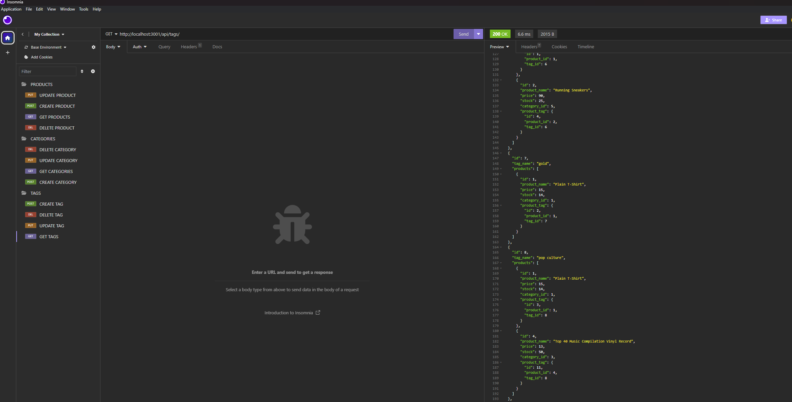

# E-commerce Back End Starter Code
  - Application Screenshot : 
  
  ## Description
  This application is created to serve as a baseline demonstration for an E-Commerce Back End database using Sequelize Routes. 
  
  ## Table of Contents
  - [Installation](#installation)
  - [Usage](#usage)
  - [Contributing](#contributing)
  - [Questions](#questions)
  
  ## Installation
  Any user can clone the repository provided here "https://github.com/chadedwardsofficial/ORM-E-Commerce-Back-End". Please make sure you download correct dependencies for your package-json file which is inquirer and mysql2.
  
  ## Usage
  To use the provided application, open up vs-code, run an integrated terminal. Run mysql -uroot -p(if you have a password);
  
  
  ## Demo
  - Application Video : https://drive.google.com/file/d/1PopCmRJntvL36XSl-LxQnxwnh8A14z5N/view
  

  
  ## Contributing
  Contributors were sequelize, mysql2 node and express.js & dotenv package.  

  ## Questions
  My email [chadedwardsofficial@gmail.com](mailto:chadedwardsofficial@gmail.com). You can also find me on [GitHub](https://github.com/chadedwardsofficial).
  